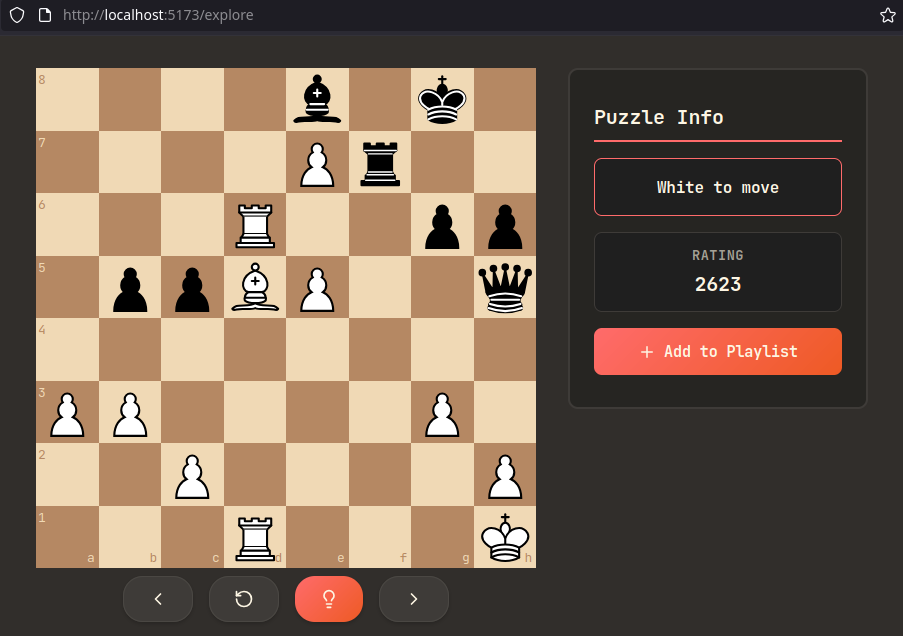

# Woodpecker Chess
[](https://skillicons.dev)

The Woodpecker Method, introduced by Axel Smith in his book **The Woodpecker Method**, is a chess training approach that involves repeatedly solving the same set of tactical puzzles to strengthen pattern recognition and calculation speed. The approach is like spaced repetition but opposite, you complete the set of puzzles with decreasing intervals instead of increasing.

This is a web application project: a chess puzzle repetition trainer. Just something I did for fun. While the project is very far from the projected, polished version of the application, below shows my progress so far.

---



## Features

### Technologies Used

- **React** - UI framework
- **TypeScript** - Type safety 
- **Vite** - Fast build tool and dev server
- **react-chessboard** - Chessboard component
- **chess.js** - Chess logic and move validation

### Implemented
* Chessboard using `react-chessboard` component
* Move validation against puzzle solution sequences
* UI feedback for correct/incorrect moves (would need some polishing though)
* Puzzle navigation controls (**Next** and **Reset**)
* Playing puzzles using data from [Lichess puzzle database](https://database.lichess.org/#puzzles)
* Custom hook (`useChessPuzzle`) for puzzle state management
* Automatic opponent move responses after correct player moves

### To-Do List
* Rating-based puzzle filtering (1500-1999, 2000-2499, etc.)
* Implement hint system
* Some user results tracking and statistics
* Spaced repetition algorithm: mark puzzles as `learned`/`needs review` and requeue accordingly
* User playlists to save favorite puzzles
* Analytics dashboard: per-puzzle success rate, average solve time, rating progression
* Mobile-responsive UI design
* User authentication and profiles
* Daily puzzle challenges
* Achievement system and progress milestones

---

## Puzzles
- Puzzle data from [Lichess.org](https://lichess.org) - licensed under CC0

## Puzzle Data Format

Puzzles are sourced from the Lichess puzzle database and structured as follows:

```typescript
interface LichessPuzzle {
  PuzzleId: string;      // Unique puzzle identifier
  FEN: string;           // Position before opponent's setup move
  Moves: string;         // UCI format moves (space-separated)
  Rating: number;        // Puzzle difficulty rating
  Themes: string;        // underscore-separated theme tags
  OpeningTags?: string;  // Opening family/variation (optional)
}
```

### Example Puzzle Object
```json
{
  "PuzzleId": "00AfG",
  "FEN": "r1bqkb1r/pppp1ppp/2n2n2/4p3/2B1P3/5N2/PPPP1PPP/RNBQK2R w KQkq - 4 4",
  "Moves": "d2d4 e5d4 c4f7 e8f7 f3d4",
  "Rating": 1567,
  "Themes": "fork",
  "OpeningTags": "Italian_Game Italian_Game_Classical_Variation"
}
```

### Notes on Puzzle Format
- **FEN**: Starting position before the opponent's move
- **Moves**: First move is opponent's setup, followed by alternating player/opponent solution moves
- **UCI Format**: Moves use coordinate notation (e.g., `e2e4` not `e4`)
- Puzzles are stored as JSON files grouped by rating ranges in the `public` directory

---

## How It Works (for now)

1. **Puzzle Loading**: Puzzles are fetched from JSON files in the `public` directory, filtered by rating range
2. **Initial Setup**: The first move in the solution is played automatically (opponent's setup move)
3. **Player**: Player makes moves by dragging pieces on the board
4. **Move Validation**: Moves are validated against the expected UCI move sequence
5. **Opponent Response**: After a correct move, the opponent's response from the solution sequence is played.
6. **Completion**: Puzzle is marked as solved when all moves in the sequence are completed correctly

---

## Installation & Setup

```bash
# Clone the repository
git clone <repo-url>
cd woodpecker

# Install dependencies
npm install

# Start development server
npm run dev

# Build for production
npm run build

# Preview production build
npm run preview
```

The app will be available at `http://localhost:5173` (or the port shown in terminal).

